<div align="center">

# PIVOT
### Pose, Intrinsics and Viewpoint Oriented Testbed

# 🛸 A Multi-Trajectory Dataset and TestLab for Pose, Intrinsics and Novel Viewpoint Evaluation in Real-World 3D Reconstruction

[](https://github.com/maryraymond/PIVOT/pkgs/container/pivot)
[](#download-the-dataset)
[](https://github.com/maryraymond/PIVOT)
[](LICENSE)
[](https://creativecommons.org/licenses/by-nc/4.0/)
[](https://github.com/maryraymond/PIVOT/pkgs/container/pivot)
[](https://github.com/maryraymond/nerfstudio_PIVOT_integration/tree/pivot_integration)
[]()

<p align="center">
  
</p>

</div>

------------------------------------------------------------------------


# Quick Start

## 1. Get PIVOT

```bash
git clone https://github.com/maryraymond/PIVOT.git
cd PIVOT
```

## 2. Pull or build the PIVOT Docker image

The PIVOT container contains the processing, calibration, visualization,
COLMAP, and dataset-export environment.

### Pull from GHCR

```bash
docker pull ghcr.io/maryraymond/pivot:1.0.0
docker tag ghcr.io/maryraymond/pivot:1.0.0 pivot:1.0.0
```

### Or pull the latest version

```bash
docker pull ghcr.io/maryraymond/pivot:latest
docker tag ghcr.io/maryraymond/pivot:latest pivot:latest
```

### Or build locally

```bash
docker build -t pivot:latest .
```

Run using the repository Docker launcher after configuring the host
dataset paths:

```bash
./run_docker.sh
```

> [!TIP]
> The container is the recommended environment because the processing
> pipeline depends on a coordinated COLMAP/Ceres/Python stack and
> ExifTool.

## 3. Download the dataset

The processed PIVOT dataset is distributed through **Hugging Face**
under **CC BY-NC 4.0**.

```text
Dataset page: https://huggingface.co/datasets/MaryRaymond/PIVOT
```

**Download instructions — TODO when the Hugging Face repository is
public**

To download the full dataset, run the following in the pivot docker container:

```bash
	hf download MaryRaymond/PIVOT \
  --repo-type dataset  \
  --local-dir /path/to/pivot_dataset
```

or to download one specific scene (for example church) run

```bash
	hf download MaryRaymond/PIVOT \
  --repo-type dataset  \
	--include "scenes/church/**" \
  --local-dir /path/to/pivot_dataset
```

The source code and dataset are licensed separately. See
[License](#license).

## 4. Visualize a scene

```bash
python scripts/visualize_scene.py \
    --dataset-root /path/to/pivot_dataset \
    --scene-name church \
    --port 8080
```

Optionally restrict the displayed trajectories:

```bash
python scripts/visualize_scene.py \
    --dataset-root /path/to/pivot_dataset \
    --scene-name church \
    --port 8080 \
    --trajectories orbit_inward_low traversal_forward_low traverse_loop_low \
    --frustums-visible
```

Open the viewer URL printed by Viser in your browser.

<p align="center">
  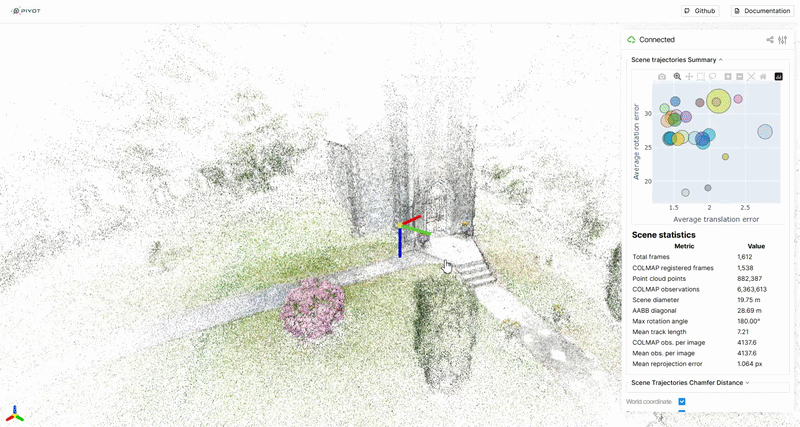
</p>

For full features of the visualization tool see section
**Interactive Visualization** in this document

## 5.Export a PIVOT Scene to Nerfstudio DS

PIVOT's exporter allows pose and intrinsic choices to be made **per
trajectory and per split**.

```bash
python scripts/export_dataset.py \
    --scene-dir /data/processed/church \
    --dst-dir /data/ns_processed/church_experiment \
    --use-sparse-pc \
    --scene-config '{
      "train": {
        "orbit_inward_low": {
          "c2w_rot_optimized": true,
          "c2w_trans_optimized": true,
          "camera_intrinsics_optimized": true,
          "fill_missing_poses_with_non_optimized": false,
          "percentage": 0.9
        }
      },
      "eval": {
        "orbit_inward_low": {
          "c2w_rot_optimized": true,
          "c2w_trans_optimized": true,
          "camera_intrinsics_optimized": true,
          "fill_missing_poses_with_non_optimized": false
        }
      }
    }'
```

The `--scene-config` value may describe individual trajectories,
allowing a single export to construct controlled experiments.

## Scene-config fields

| Field                                     | Meaning                                                                      |
| ----------------------------------------- | ---------------------------------------------------------------------------- |
| `c2w_rot_optimized`                     | `true`: use COLMAP rotation; `false`: use measured rotation              |
| `c2w_trans_optimized`                   | `true`: use COLMAP translation; `false`: use measured translation        |
| `camera_intrinsics_optimized`           | `true`: use COLMAP intrinsics; `false`: use calibrated intrinsics        |
| `fill_missing_poses_with_non_optimized` | Use the measured pose when a frame has no COLMAP pose instead of dropping it |
| `percentage`                            | Training-side fraction of the selected trajectory to export                  |

You can therefore create the four pose-source combinations:

| Configuration | Translation | Rotation  |
| ------------- | ----------- | --------- |
| **OO**  | optimized   | optimized |
| **OM**  | optimized   | measured  |
| **MO**  | measured    | optimized |
| **MM**  | measured    | measured  |

An `"all"` entry can be used when the same configuration should apply
across all trajectories in a split.

The exported `transforms.json` stores **per-frame intrinsics**, allowing
trajectories with different camera configurations or image dimensions to
coexist in the exported dataset.

---

# Project Overview

Modern **NeRF**, **3D Gaussian Splatting**, and related reconstruction
methods are often developed and evaluated under conditions that are
substantially cleaner than those encountered by robots, drones, and
autonomous systems in the real world.

PIVOT is designed to make those differences **explicit, measurable, and
reproducible**.

Instead of representing a scene with one reconstruction-friendly camera
path, PIVOT represents each scene as a collection of deliberately
different **camera trajectories**. Every processed frame can carry both
a sensor-derived **measured pose** and a **COLMAP-optimized pose**,
while trajectories may use calibrated or scene-optimized camera
intrinsics. This makes it possible to isolate questions such as:

- How much reconstruction quality is gained by replacing measured robot
  poses with offline-optimized poses?
- How much does per-scene intrinsic optimization improve over a fixed
  physical camera calibration?
- How well does a model generalize to camera paths that are structurally
  different from its training trajectories?
- How does reconstruction quality change as the evaluation trajectory
  moves farther from the training pose distribution?
- Which capture trajectories are easy or difficult for
  Structure-from-Motion?
- Which anchor trajectories could be added to a scene with diffucult
  trajectories to improve the Structure-from-Motion registeration rates?

PIVOT includes:

| Component                                | What it provides                                                                                                                                                                                              |
| ---------------------------------------- | ------------------------------------------------------------------------------------------------------------------------------------------------------------------------------------------------------------- |
| **Dataset design**                 | A scene/trajectory taxonomy covering reconstruction-friendly and robot-like camera motion with a dual-pose representation where Sensor-derived measured poses and COLMAP-optimized poses stored side by side |
| **Dataset assets**                 | Five real-world scenes captured with a DJI Mini 4 Pro drone                                                                                                                                                   |
| **Raw-data pipeline**              | Frame sampling, metadata extraction, measured poses, COLMAP soft-prior mapping, statistics, and scene export that allows the user to process his/her own scene capture                                        |
| **Pose Directed Chamfer Distance** | A normalized trajectory-distance measure for comparing evaluation and training viewpoints                                                                                                                     |
| **Interactive viewer**             | Viser-based inspection of point clouds, trajectories, pose errors, statistics, and trajectory-distance matrices that facilitate experiments design.                                                           |
| **Nerfstudio exporter**            | Flexible conversion from PIVOT scenes to Nerfstudio datasets                                                                                                                                                  |
| **Nerfstudio integration**         | Custom per-trajectory evaluation and benchmark automation                                                                                                                                                     |
| **Benchmarks design**              | Novel-view generalization, measured-vs-optimized pose, and calibrated-vs-optimized intrinsics                                                                                                                 |

> [!NOTE]
> PIVOT does **not** propose a new NeRF, Gaussian Splatting, or SfM
> algorithm. It is a dataset, processing pipeline, evaluation framework,
> and testbed for studying reconstruction under more realistic capture
> conditions.

---

## A Reusable Capture Standard, Not Just a Dataset

PIVOT is not only a collection of captured scenes. It defines a **scene capture specification and open toolchain** that researchers can reuse for their own data.

PIVOT defines:

- a **scene format** describing how a processed scene and its metadata are represented;
- a **trajectory protocol** with named and typed camera paths covering motion type, altitude, camera direction, lens, and capture mode;
- a **processing pipeline** from raw captures to measured poses, COLMAP reconstruction, pose-error statistics, trajectory metrics, visualization, and Nerfstudio-ready export.

This means a researcher can capture a new scene using the PIVOT trajectory protocol, process it into the same representation, compare it with existing PIVOT scenes, and extend the trajectory taxonomy while retaining the same evaluation framework.

The long-term idea is a multi-scene benchmark in which captures from different environments remain comparable because they follow a shared trajectory protocol and processing pipeline.

---

# Why PIVOT?

Typical reconstruction benchmarks can unintentionally couple several
favorable assumptions:

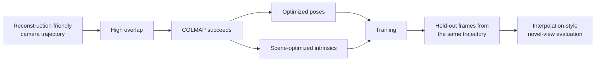

PIVOT separates these factors:

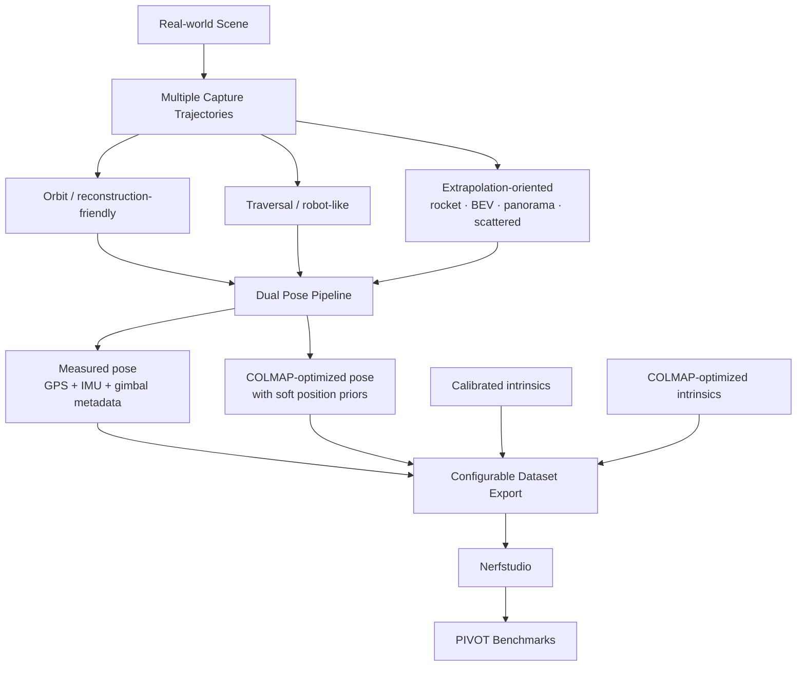

The goal is to move evaluation beyond **“Can this model reconstruct a
scene under ideal capture conditions?”** toward **“How does it behave
when the poses, intrinsics, trajectories, and requested viewpoints look
more like a deployed system?”**

---

# Dataset Assets

PIVOT v1 is built around **five real-world scenes** captured with the DJI Mini 4 Pro drone. The released processed scenes contain trajectory images, per-frame measured and COLMAP-optimized poses, camera intrinsics, trajectory statistics, scene statistics, and sparse reconstruction assets.

| Scene                | Frames | COLMAP registered | Registration rate | Sparse points | AABB diagonal | Mean reprojection error |
| -------------------- | -----: | ----------------: | ----------------: | ------------: | ------------: | ----------------------: |
| `church`           |  1,612 |             1,538 |             95.4% |       882,387 |       28.68 m |                1.064 px |
| `village_street`   |  1,733 |             1,726 |             99.5% |     1,430,217 |       55.12 m |                0.893 px |
| `victorian_garden` |  1,547 |             1,536 |             99.2% |       767,781 |       44.62 m |                0.928 px |
| `frontyard`        |    920 |               913 |             99.2% |       719,123 |        13.16m |                1.096 px |
| `backyard`         |  1,536 |             1,527 |             99.4% |     1,101,253 |         25.3m |                  0.97px |

> [!Known issues] Known issues
> - PIVOT dataset v1.0.0 **Church** scene — **rocket_upward**: the rocket-upward trajectory was not successfully registered by COLMAP. The trajectory and its measured poses remain part of the dataset, but COLMAP-optimized poses are unavailable for this trajectory. This is planned to be addressed in an upcoming dataset version.
> - The opencv camera calibration used in PIVOT dataset v1.0.0 has a bad reprojection error ~4 px this need to be improved in future versions

> [!NOTE]
> PIVOT intentionally records both **total frames** and **COLMAP-registered frames**. Some trajectories are deliberately difficult for SfM, so registration rate is itself useful information rather than only a preprocessing detail.

## Scene Trajectory Coverage

Legend: ✅ Available · ❌ Not available · ⚠️ Available, but COLMAP registration failed

### Mandatory trajectories

| Trajectory | Church | Village Street | Victorian Garden | Frontyard | Backyard |
|---|:---:|:---:|:---:|:---:|:---:|
| `orbit_inward_low` | ✅ | ✅ | ✅ | ✅ | ✅ |
| `orbit_inward_mid` | ✅ | ✅ | ✅ | ✅ | ✅ |
| `orbit_inward_high` | ✅ | ✅ | ✅ | ✅ | ✅ |
| `traversal_forward_low` | ✅ | ✅ | ✅ | ✅ | ✅ |
| `traversal_backward_low` | ✅ | ✅ | ✅ | ✅ | ✅ |
| `traversal_left_low` | ✅ | ✅ | ✅ | ✅ | ✅ |
| `traversal_right_low` | ✅ | ✅ | ✅ | ✅ | ✅ |
| `traverse_loop_low` | ✅ | ✅ | ✅ | ✅ | ✅ |
| `bev_orbit_area` | ✅ | ✅ | ✅ | ✅ | ✅ |
| `rocket_upward` | ⚠️ | ✅ | ✅ | ✅ | ✅ |
| `scattered_low` | ✅ | ✅ | ✅ | ✅ | ✅ |
| `panorama_360_station_a` | ✅ | ✅ | ✅ | ✅ | ✅ |
| `panorama_360_station_b` | ✅ | ✅ | ✅ | ✅ | ✅ |
| `panorama_360_station_c` | ✅ | ✅ | ✅ | ✅ | ✅ |
| `orbit_outward_low` | ✅ | ✅ | ✅ | ✅ | ✅ |
| `bev_traverse_area` | ✅ | ✅ | ✅ | ✅ | ✅ |

### Optional trajectories

| Trajectory | Church | Village Street | Victorian Garden | Frontyard | Backyard |
|---|:---:|:---:|:---:|:---:|:---:|
| `orbit_outward_mid` | ✅ | ❌ | ❌ | ❌ | ❌ |
| `orbit_outward_high` | ✅ | ❌ | ❌ | ❌ | ❌ |
| `traversal_forward_mid` | ✅ | ❌ | ❌ | ✅ | ✅ |
| `traversal_backward_mid` | ✅ | ❌ | ❌ | ✅ | ✅ |
| `traversal_left_mid` | ✅ | ❌ | ❌ | ✅ | ✅ |
| `traversal_right_mid` | ✅ | ❌ | ❌ | ✅ | ✅ |
| `traversal_forward_high` | ❌ | ❌ | ❌ | ❌ | ❌ |
| `traversal_backward_high` | ❌ | ❌ | ❌ | ❌ | ❌ |
| `traversal_left_high` | ❌ | ❌ | ❌ | ❌ | ❌ |
| `traversal_right_high` | ❌ | ❌ | ❌ | ❌ | ❌ |
| `scattered_mid` | ✅ | ❌ | ✅ | ✅ | ✅ |
| `scattered_high` | ✅ | ✅ | ✅ | ✅ | ✅ |

---

# Project Details

## The four evaluation gaps

### 1. Camera trajectory

Circular inward-looking orbits provide strong overlap and are excellent
for reconstruction. Real platforms frequently move along traversal paths
instead.

PIVOT deliberately includes both reconstruction-friendly and robot-like
motion.

### 2. What counts as a novel view?

A conventional held-out image is often an interpolated frame from a
trajectory also used for training. In many applications, the desired
viewpoint lies on an entirely different path.

PIVOT makes the **trajectory itself** a first-class unit of evaluation.

### 3. Pose source

Offline SfM systems can provide highly accurate optimized poses, but
deployed robots may instead rely on GPS/IMU for realtime poses, visual(-inertial) odometry,
SLAM, LiDAR, radar, or another online localization system.

PIVOT stores both:

- `measured_pose_c2w` — derived from capture-device metadata without
  scene-level pose optimization.
- `colmap_pose_c2w` — reconstructed by COLMAP using measured positions
  as **soft position priors**.

This enables controlled measured-vs-optimized pose experiments.

### 4. Camera intrinsics

A benchmark reconstruction can optimize camera intrinsics for every
scene. A physical robot, however, usually carries a camera with a
calibration that is reused across scenes.

PIVOT therefore retains both:

- physical/offline **camera calibration** parameters;
- **COLMAP-optimized** per-scene intrinsics.

---

## Pose Directed Chamfer Distance

PIVOT uses a **directed** trajectory-distance measure to describe how
well one set of poses covers another.

For evaluation trajectory (A) and reference/training poses (B):

\[ D(A \rightarrow B) = \frac{1}{\|A\|} \sum\_{a \in A}
\operatorname{kNNDistance}(a, B) \]

The pose distance combines normalized translation and rotation
components. Because the metric is directed:

\[ D(A \rightarrow B) \neq D(B \rightarrow A) \]

This is intentional: **“How well does the training pose set cover the
evaluation trajectory?”** is not the same question as the reverse.

PIVOT computes:

- combined normalized translation + rotation distance;
- translation-only normalized distance;
- rotation-only normalized distance.

At scene-processing time, these values are computed across trajectory
pairs and displayed as a heatmap. During reconstruction evaluation, the
same idea is used to measure each evaluation trajectory against the
training pose set.

---

## Dataset Design

### Scene requirements

PIVOT v1.0.0 scenes are designed around the following principles:

- a meaningful focal object or region around which orbit trajectories
  can be captured;
- sufficient architecture/texture rather than a texture-poor landscape;
- daylight capture for the v1 assets;
- minimal dynamic content;
- camera settings chosen to keep the imaging configuration stable during
  capture.

### Trajectory families

PIVOT combines trajectories that resemble common reconstruction datasets
with trajectories intended to resemble deployed robotic motion or stress
extrapolated novel views.

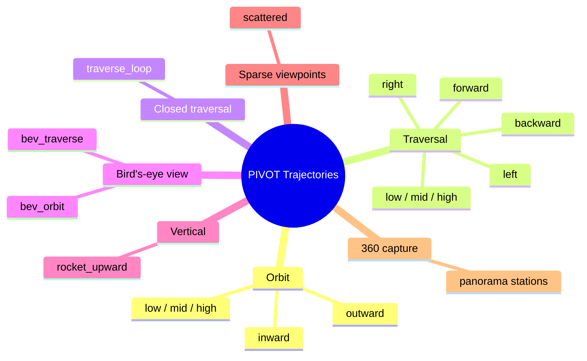

#### Core trajectories

| Trajectory                     | Motion           |    Altitude | Camera direction | Capture |
| ------------------------------ | ---------------- | ----------: | ---------------- | ------- |
| `orbit_inward_low`           | orbit            |         low | scene inward     | video   |
| `orbit_inward_mid`           | orbit            |         mid | scene inward     | video   |
| `orbit_inward_high`          | orbit            |        high | scene inward     | video   |
| `traversal_forward_low`      | traversal        |         low | along track      | video   |
| `traversal_backward_low`     | traversal        |         low | along track      | video   |
| `traversal_left_low`         | traversal        |         low | along track      | video   |
| `traversal_right_low`        | traversal        |         low | along track      | video   |
| `traverse_loop_low`          | closed traversal |         low | along track      | video   |
| `bev_orbit_area`             | BEV orbit        |        high | nadir            | video   |
| `rocket_upward`              | vertical ascent  | low → high | scene inward     | video   |
| `scattered_low`              | scattered        |         low | multi-angle      | photos  |
| `panorama_360_station_a/b/c` | panorama         |  low → mid | 360° sweep      | photos  |

Optional trajectories extend the same design with outward orbits,
mid/high traversals, BEV traversal, downward vertical motion, and
additional scattered viewpoints.

---

## The PIVOT Processing Pipeline

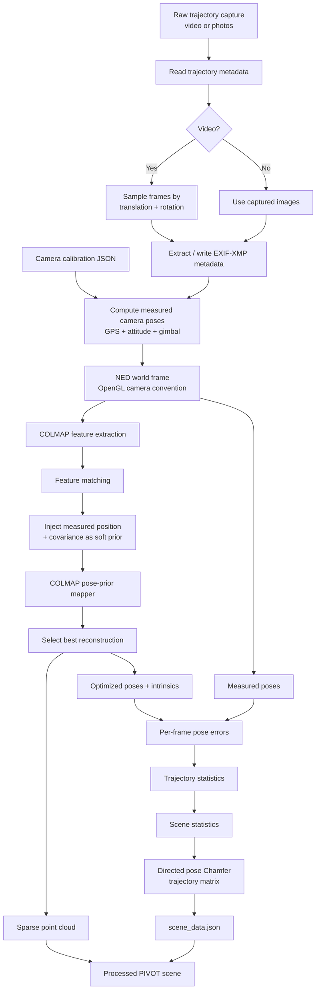

The resulting processed scene preserves the original trajectory identity
instead of flattening all images into one undifferentiated capture.

---

## Research Use Cases

PIVOT is designed to support several related research questions:

1. **True novel-view generalization** — train on one set of trajectories and evaluate on structurally different held-out trajectories rather than only interpolated frames.
2. **Pose-quality sensitivity** — compare reconstruction with measured and COLMAP-optimized pose components.
3. **Trajectory design for efficient capture** — investigate which combination of camera paths provides the best coverage for a fixed capture budget.
4. **Altitude and viewpoint diversity** — use low/mid/high and BEV trajectories to study how viewpoint coverage affects reconstruction.
5. **Calibration sensitivity** — compare reusable physical camera calibration with scene-specific COLMAP-optimized intrinsics.

---

## Pose and Coordinate Conventions

PIVOT's measured-pose path can be summarized as:

```text
GPS + flight attitude + gimbal attitude
                │
                ▼
        NED world-frame pose
                │
                ▼
   camera-to-world homogeneous transform
                │
                ▼
      OpenGL camera convention
                │
                ▼
        measured_pose_c2w
```

The processed dataset uses:

- **World frame:** NED (North-East-Down), with `+Z` pointing down.
- **PIVOT camera pose:** OpenGL-style camera convention.

> [!IMPORTANT]
> Coordinate-frame conversions are part of the dataset contract. If you
> add a new capture device, validate pose axes, handedness,
> yaw/pitch/roll ordering, and camera-forward direction before producing
> data.

---

# Usage Manual

## Process your own raw data

A raw scene is driven by a trajectory description and a set of
trajectory captures.

Example:

```bash
python scripts/process_raw_data.py \
    --scene-raw-dir /data/raw/my_scene \
    --scene-processed-dir /data/processed/my_scene \
    --calibration-files-path /workspace/data/ \
    --pos-covariance 2 2 2 \
    --max-num-models 4 \
    --chamfer-translation-scale aabb_diagonal \
    --chamfer-rotation-scale-mode max_rotation
```

### Raw trajectory description

The trajectory metadata describes properties such as:

```json
{
  "traversal_forward_low": {
    "mandatory_level": "core",
    "motion_type": "traversal",
    "altitude_band": "low",
    "path_closed": false,
    "camera_direction": "along_track",
    "lens_type": "wide_fov",
    "res": [3840, 2160],
    "aspect_ratio": "16:9",
    "capture_mode": "video_frames",
    "capture_device": "dji_drone_mini_4_pro"
  }
}
```

Raw trajector folder structue example

```text
church/
├── panorama_360_station_a/
│   ├── PANO_0001.JPG
│   ├── PANO_0002.JPG
│   ├── PANO_0003.JPG
│   ├── PANO_0004.JPG
│   └── ...
├── panorama_360_station_b/
│   ├── PANO_0001.JPG
│   ├── PANO_0002.JPG
│   ├── PANO_0003.JPG
│   └── ...
├── panorama_360_station_c/
│   ├── PANO_0001.JPG
│   ├── PANO_0002.JPG
│   ├── PANO_0003.JPG
│   └── ...
├── scattered_high/
│   ├── DJI_0001.JPG
│   ├── DJI_0002.JPG
│   ├── DJI_0003.JPG
│   └── ...
├── scattered_low/
│   ├── DJI_0001.JPG
│   ├── DJI_0002.JPG
│   ├── DJI_0003.JPG
│   └── ...
├── scattered_mid/
│   ├── DJI_0001.JPG
│   ├── DJI_0002.JPG
│   ├── DJI_0003.JPG
│   └── ...
├── bev_orbit_area.MP4
├── bev_traverse_area.MP4
├── orbit_inward_high.MP4
├── orbit_inward_low.MP4
├── orbit_inward_mid.MP4
├── orbit_outward_high.MP4
├── orbit_outward_low.MP4
├── orbit_outward_mid.MP4
├── rocket_upward.MP4
├── trajectories_metadata.json
├── traversal_backward_low.MP4
├── traversal_backward_mid.MP4
├── traversal_forward_low.MP4
├── traversal_forward_mid.MP4
├── traversal_left_low.MP4
├── traversal_left_mid.MP4
├── traversal_right_low.MP4
├── traversal_right_mid.MP4
└── ...
```

The trajectories_metadata.json file could be found at (https://github.com/maryraymond/PIVOT/blob/main/data/trajectories_metadata.json) the trajectory description could be edited as required

For video trajectories, the processed scene also records the sampling
method and thresholds. For example, PIVOT can sample frames after a
minimum translation or rotation from the last accepted frame.

---

## Camera calibration

PIVOT includes checkerboard-based OpenCV calibration for pinhole and
fisheye cameras.

```bash
python scripts/calibrate_camera.py \
    --input /path/to/checkerboard/video_or_folder \
    --output data/my_camera_calibration.json
```

For a fisheye camera:

```bash
python scripts/calibrate_camera.py \
    --input /path/to/checkerboard/video_or_folder \
    --output data/my_fisheye_calibration.json \
    --fisheye
```

The calibration output is consumed directly by the raw-data pipeline and
includes the camera model, image dimensions, focal lengths, principal
point, distortion parameters, and calibration RMS error.

> [!TIP]
> Use a diverse checkerboard capture: cover the image corners and edges,
> vary board orientation and distance, avoid motion blur, and inspect
> reprojection error before relying on the calibration for benchmark
> experiments.

---

## Extend PIVOT to another capture device

The processing core is designed so capture-device metadata handling can
be extended beyond the DJI Mini 4 Pro.

A new device integration has three main pieces:

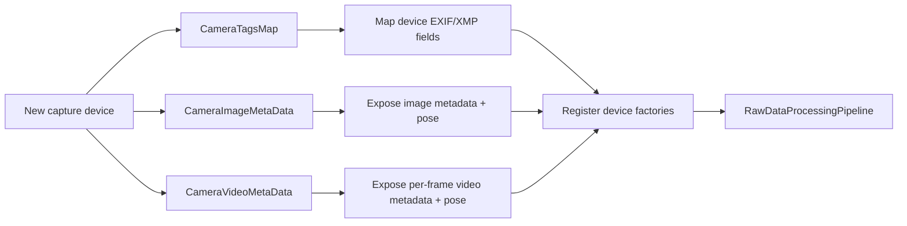

### 1. Implement the metadata tag map

Implement the `CameraTagsMap` interface in:

```text
src/data_processing/core/camera_metadata_abc.py
```

Map the fields needed by PIVOT, including the device's GPS position and
camera/platform orientation metadata.

Use the DJI implementation as the reference:

```text
src/data_processing/supported_capture_devices/dji_drone_mini_4.py
```

### 2. Implement image/video metadata readers

Implement the relevant `CameraImageMetaData` and `CameraVideoMetaData`
interfaces and provide the pose conversion expected by the processing
core.

### 3. Register the device

Add image/video factory callables to the supported-device registries
used by `RawDataProcessingPipeline`. The registry key must match the
`capture_device` value in the trajectory description.

---

# Dataset Structure

A processed scene is organized around a `scene_data.json` file,
trajectory image directories, and the COLMAP reconstruction.

```text
<PIVOT_DATASET>/
└── church/
    ├── scene_data.json
    ├── trajectories/
    │   ├── orbit_inward_low/
    │   │   ├── frame_000000.JPG
    │   │   ├── frame_000001.JPG
    │   │   └── ...
    │   ├── traversal_forward_low/
    │   └── ...
    └── PYCOLMAP_soft_prior/
        └── ... sparse reconstruction assets ...
```

## `scene_data.json`

Conceptually:

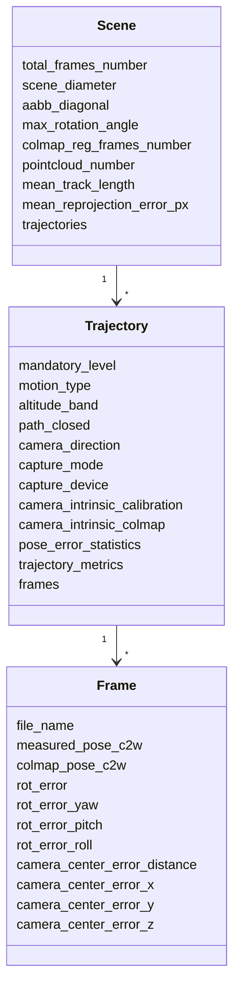

### Example frame

```json
{
  "file_name": "trajectories/traversal_forward_low/frame_000000.JPG",
  "measured_pose_c2w": [
    [0.9985, -0.0012, -0.0541, 0.0370],
    [0.0541, 0.0227, 0.9983, 8.6494],
    [0.0000, -0.9997, 0.0227, 3.5340],
    [0.0000, 0.0000, 0.0000, 1.0000]
  ],
  "colmap_pose_c2w": [
    [0.8667, -0.0078, -0.4988, -0.2402],
    [0.4985, -0.0221, 0.8666, 9.9659],
    [-0.0177, -0.9997, -0.0152, 4.1069],
    [0.0000, 0.0000, 0.0000, 1.0000]
  ],
  "rot_error": 26.93,
  "camera_center_error_distance": 1.46
}
```

This dual representation is central to PIVOT: a downstream experiment
can choose measured or optimized translation and rotation rather than
requiring a second dataset conversion pipeline.

---

# Interactive Visualization

The visualization tool is one of PIVOT's main analysis interfaces. Built with **Viser**, it combines **scene inspection**, **pose-error analysis**, and **experiment design** in an interactive browser-based 3D viewer.

```bash
python scripts/visualize_scene.py \
    --dataset-root /data/processed \
    --scene-name church \
    --port 8080
```

The scene view can display the COLMAP sparse point cloud together with color-coded trajectory paths and camera frustums. Measured and optimized poses can be shown independently, while error vectors connect corresponding measured and optimized camera centers. Captured images can also be displayed on camera frustum planes.

<p align="center">
  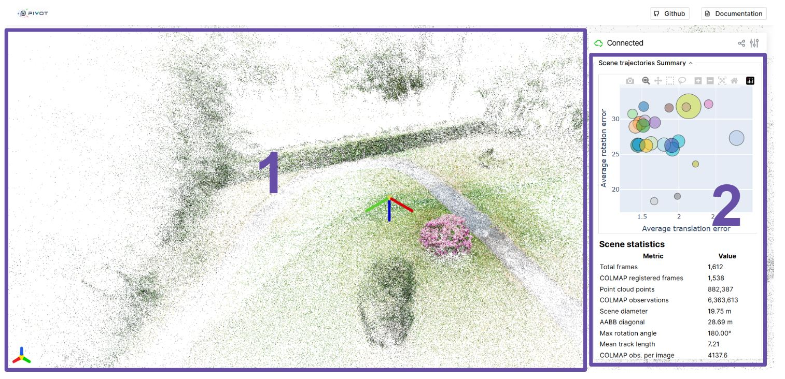
</p>

**1-** Main window that shows the scene sparse point cloud and the trajectory poses if selected

**2-** The Scene trajectories summary folder containing the trajectories statistics bubble chart and the overall scene statistics

<p align="center">
  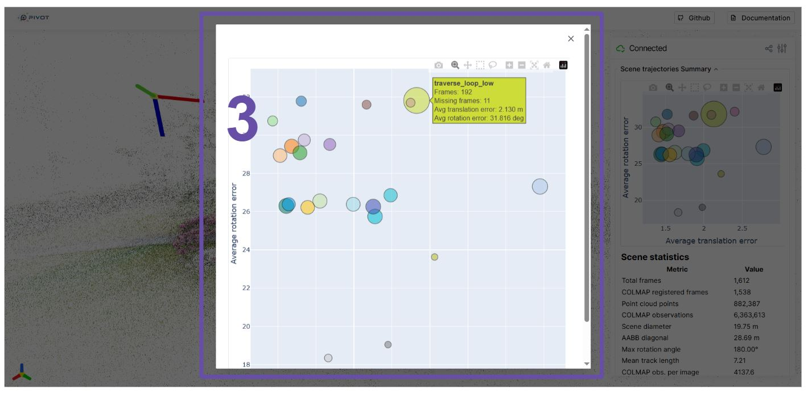
</p>

**3-** The trajectories statistics bubble chart could be expanded, and when hovering over each bubble it will show the trajectory name and overall data

<p align="center">
  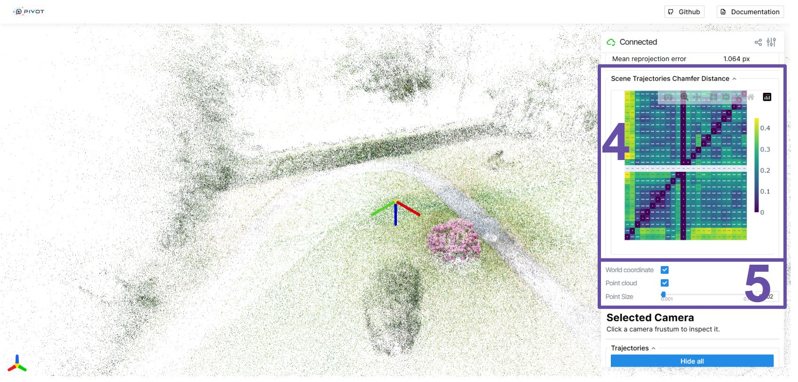
</p>

**4-** Scene directed pose chamfer distance matrix heatmap across all trajectories in the scene

**5-** Checkboxes to show or hide the point cloud and world coordinate system, also a slider to increase or decrease the size of the points for the point cloud

<p align="center">
  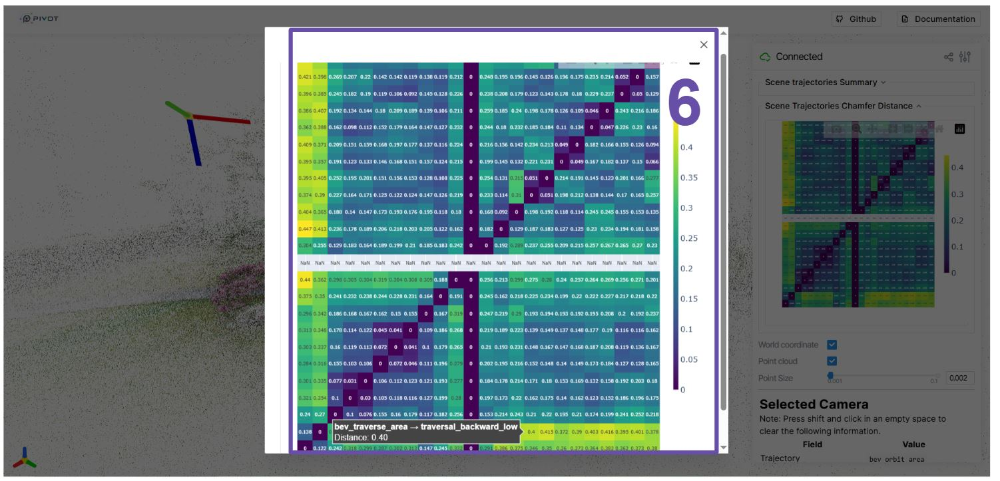
</p>

**6-** The directed pose chamfer distance heatmap could be expanded and when however over a cell the source and distinction trajectory as well as the metric distance will be shown

<p align="center">
  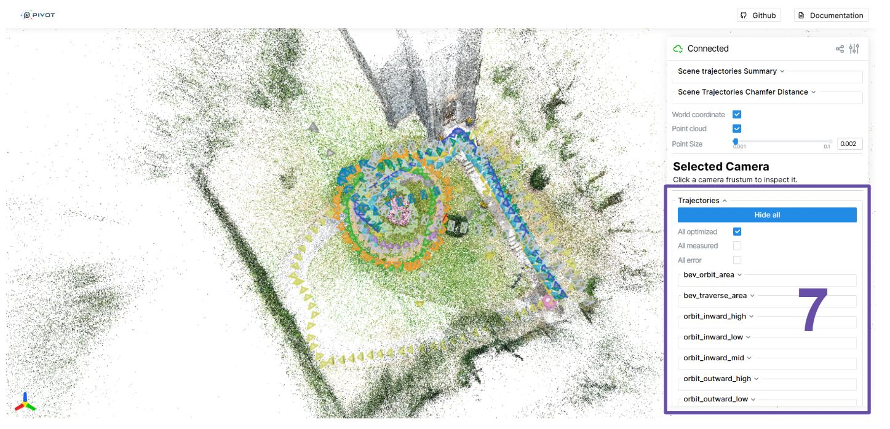
</p>

**7-** The trajectories folder where you can control which information to show for the trajectories, 3 checkboxes are available to show for all trajectories the measure, optimized poses and the error between them, the hide all button will remove any trajectory data that was added

<p align="center">
  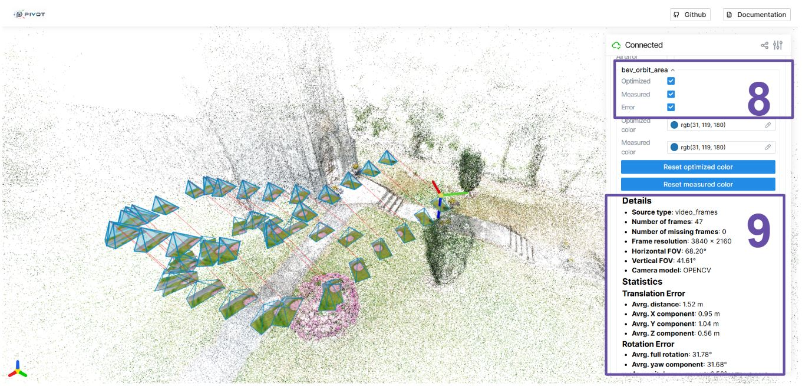
</p>

**8-** each individual trajectory folder could be expanded to select to show measured posed, optimized poses and/or error between them

**9-** The Trajectory information and statistics will be shown

<p align="center">
  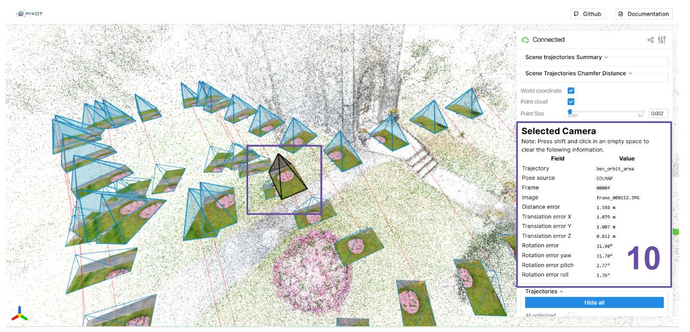
</p>

**10-** By selecting an individual camera frustum, the frustum color will be changed to back (hold ctrl and click anywhere to clear) and that frustum information will be shown in the selected camera window

<p align="center">
  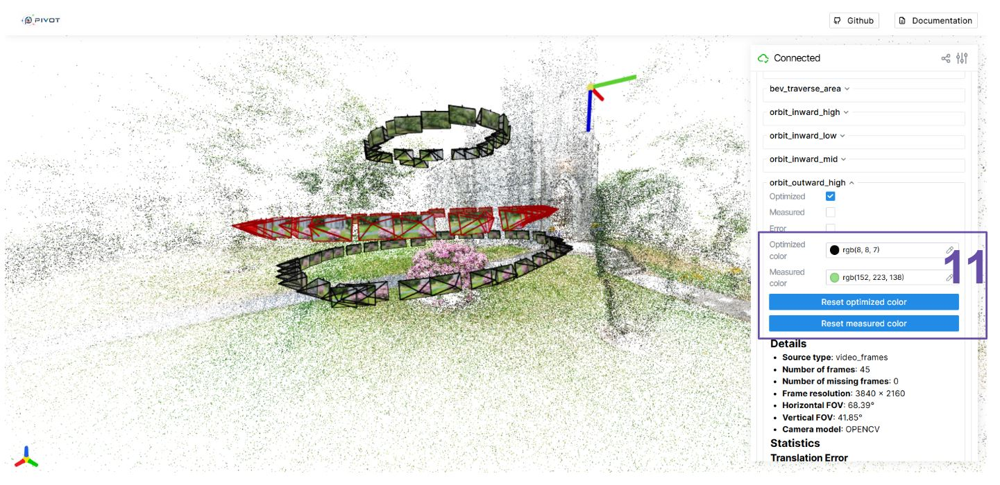
</p>

**11-** For each individual trajectory the default color of the optimized poses and/or the measured poses could be changed, this feature is useful when planning which trajectories to use for testing and which trajectories to use for evaluation (the red and black color is reserved and not used by default for the frustums) the frustums colors could be rested to default using the reste color buttons

---

# Nerfstudio Integration

PIVOT provides a separate Nerfstudio integration environment for:

1. PIVOT-compatible training data;
2. Nerfacto and Splatfacto benchmark execution;
3. custom per-trajectory reconstruction evaluation;
4. trajectory-distance reporting relative to the training pose set.

## Pull the Nerfstudio integration image

```bash
docker pull ghcr.io/maryraymond/nerfstudio_pivot_integ:1.0.0
docker tag ghcr.io/maryraymond/nerfstudio_pivot_integ:1.0.0 pivot:1.0.0
```

Or pull the latest version

```bash
docker pull ghcr.io/maryraymond/nerfstudio_pivot_integ:latest
docker tag ghcr.io/maryraymond/nerfstudio_pivot_integ:latest pivot:latest
```

## Or build the integration image

```bash
git clone https://github.com/maryraymond/nerfstudio_PIVOT_integration
cd nerfstudio_PIVOT_integration
git checkout pivot_integration
```

```bash
docker build . -t nerfstudio_pivot_integ:latest
```

Run using the repository Docker launcher after configuring the host
dataset paths:

```bash
./run_docker.sh
```

> [!IMPORTANT]
> The PIVOT and Nerfstudio images serve different purposes. Use the
> **PIVOT image** for calibration, raw-data processing, visualization,
> and dataset export. Use the **PIVOT Nerfstudio image** for model
> training, custom evaluation, and benchmark execution.

---

# Benchmarks

PIVOT defines three benchmark families.

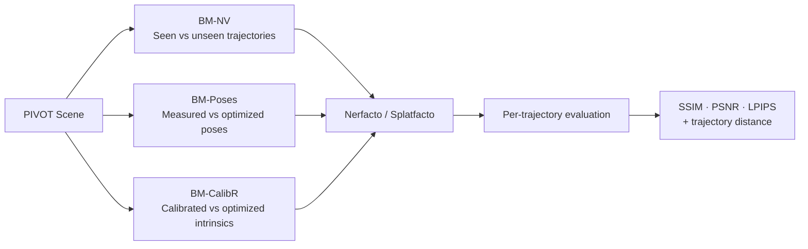

## Benchmark 1 — Novel-view: seen vs unseen trajectories

**Question:** How does reconstruction quality change when evaluation
moves from held-out frames on training trajectories to entirely
different camera trajectories?

Training uses a mixture of inward orbits and traversal trajectories.
Evaluation contains both:

- **seen trajectories:** held-out frames from trajectories represented
  in training;
- **unseen trajectories:** complete trajectories not represented in
  training.

Per-trajectory reconstruction metrics are reported together with
directed pose Chamfer distance to the training poses.

## Benchmark 2 — Measured vs optimized poses

**Question:** How much does reconstruction depend on offline pose
optimization?

Four reconstruction conditions isolate translation and rotation:

```text
OO = optimized translation + optimized rotation
OM = optimized translation + measured rotation
MO = measured translation  + optimized rotation
MM = measured translation  + measured rotation
```

## Benchmark 3 — Calibrated vs optimized intrinsics

**Question:** How much benefit comes from allowing COLMAP to optimize
intrinsics for the scene rather than using the camera's precomputed
calibration?

The pose source is held fixed while the intrinsic source changes.

## Run the benchmarks

The benchmark orchestration lives under:

```text
scripts/benchmarks/
```

The repository contains trace scripts for the novel-view, pose-source,
and camera-calibration experiments.

inside nerfstudio_pivot_integ docker container run

```bash
# Run all benchmark traces
run_benchmarks "dataset_path" "scene_name"

# Or run a benchmark family individually
run_bm_nv_trace "dataset_path" "scene_name" "output_exp_name" number_of iteration
run_bm_poses_trace "dataset_path" "scene_name" "output_exp_name" number_of iteration
run_bm_cam_calibr_trace "dataset_path" "scene_name" "output_exp_name" number_of iteration
```

for the benchmark results please check the PIVOT paper

---

# Limitations and Future Work

PIVOT provides a foundation for studying pose quality, camera calibration,
capture trajectories, and novel-view generalization in real-world 3D
reconstruction. Several directions remain open for future work.

## Geometry-Aware Trajectory Distance

PIVOT currently uses **Directed Pose Chamfer Distance** to quantify how well
a set of training camera poses covers an evaluation trajectory. The metric
compares camera translation and orientation in pose space and therefore
provides a useful measure of the geometric difference between capture
trajectories.

However, camera-pose similarity does not necessarily imply similarity in
**scene visibility**.

For example, two camera poses may be spatially close and have similar
orientations while being located on opposite sides of an occluding structure.
Their pose-space distance can therefore be small even though the two cameras
observe substantially different scene content.

This is a fundamental limitation of a trajectory metric based only on camera
poses:

> **Pose-space proximity measures where cameras are and how they are oriented,
> but not what parts of the scene they can actually observe.**

A promising direction for future work is therefore a **geometry-aware
trajectory similarity metric**.

Given an available scene reconstruction, such as the COLMAP sparse point
cloud, the visible scene geometry could be projected into each camera. The
overlap between the geometry observed from two poses could then be estimated,
for example using an **Intersection over Union (IoU)**-based visibility
measure.

Conceptually:

    Camera Pose A ──► Visible Scene Geometry A
                              │
                              ├── Intersection
                              │
    Camera Pose B ──► Visible Scene Geometry B
                              │
                              ▼
                    Visibility / Geometry IoU

Such a metric could distinguish between cameras that are close in pose space
but observe different geometry, and cameras that are farther apart while
still observing largely overlapping regions of the scene.

A future PIVOT trajectory metric could therefore combine:

- **translation difference** — how far apart the cameras are;
- **rotation difference** — how different their viewing orientations are;
- **visibility overlap** — how much scene geometry is observed by both views.

This would extend the current Directed Pose Chamfer Distance from a
**pose-space coverage metric** toward a more complete measure of
**viewpoint and scene-coverage difference**.

The existing Directed Pose Chamfer Distance remains useful because it is
simple, scene-geometry independent, and can be computed directly from camera
poses. A geometry-aware metric would instead provide a complementary measure
when a sufficiently reliable scene reconstruction is available.

# Repository Layout

```text
PIVOT/
├── src/
│   ├── data_processing/
│   │   ├── core/
│   │   └── supported_capture_devices/
│   ├── colmap_utils/
│   ├── calibration/
│   ├── utils/
│   ├── visualization/
│   ├── dataset_export/
│   ├── ns_backend/
│   └── reconstruction_eval/
├── scripts/
│   ├── benchmarks/
│   ├── process_raw_data.py
│   ├── calibrate_camera.py
│   ├── export_dataset.py
│   └── visualize_scene.py
├── data/
│   ├── trajectories_metadata.json
│   └── ... camera calibration files ...
├── assets/
│   └── ... logo and documentation assets ...
├── Dockerfile
├── run_docker.sh
├── run_docker_jupyter.sh
└── LICENSE
```

---

# Special Thanks

PIVOT would like to extend a special thank you to **Clare County Council (Ireland)** and **Bunratty Castle & Folk Park** and its staff, for their support and cooperation in facilitating the drone captures used for parts of this research.

Their assistance in enabling data collection within the Folk Park provided PIVOT with the opportunity to capture challenging, real-world scenes in a unique historic and beautiful environment. Their time, coordination, and support are sincerely appreciated.

---

# Open-Source Projects

PIVOT builds on an ecosystem of excellent open-source research and
engineering tools.

- **COLMAP** — Structure-from-Motion, feature matching, pose-prior
  mapping, and scene reconstruction.
- **Nerfstudio** — reconstruction training/evaluation framework and the
  base for the PIVOT backend integration.
- **Viser** — interactive browser-based 3D visualization used by the
  PIVOT scene viewer.
- **ExifTool** — extraction and manipulation of image/video EXIF/XMP
  metadata.
- **OpenCV** — checkerboard detection and camera calibration.
- **PyTorch / TorchMetrics / pytorch-msssim** — model-side evaluation
  dependencies.
- **Plotly, Matplotlib, NumPy, pycolmap** and the broader Python
  scientific ecosystem.

Special thanks to the maintainers and contributors of these projects.

---

# References

- **PIVOT source repository:** [github.com/maryraymond/PIVOT](https://github.com/maryraymond/PIVOT)
- **COLMAP:** [https://colmap.github.io/](https://colmap.github.io/)
- **Nerfstudio:** [https://docs.nerf.studio/](https://docs.nerf.studio/)
- **Viser:** [https://viser.studio/](https://viser.studio/)
- **ExifTool:** [https://exiftool.org/](https://exiftool.org/)
- **OpenCV Camera Calibration:** [https://docs.opencv.org/](https://docs.opencv.org/)
- **Hugging Face Datasets:** [https://huggingface.co/docs/hub/datasets](https://huggingface.co/docs/hub/datasets)

---

# Citation

If PIVOT is useful in your research, please cite the project.

<!-- TODO: Replace this block with the final arXiv/paper citation when available. -->

```bibtex
@misc{pivot2026,
  title        = {PIVOT: A Multi-Trajectory Dataset and Testbed for Pose, Intrinsics and Novel Viewpoint Evaluation in Real-World 3D Reconstruction},
  author       = {Raymond, Mary},
  year         = {2026},
  howpublished = {GitHub repository},
  note         = {PIVOT: Pose, Intrinsics and Viewpoint Oriented Testbed}
}
```

---

# License

PIVOT separates the software license from the dataset license.

### Source code

The PIVOT source code is released under the **MIT License**. See
[`LICENSE`](LICENSE).

### Dataset

The PIVOT dataset is planned for release under **Creative Commons
Attribution-NonCommercial 4.0 International (CC BY-NC 4.0)**.

This permits reuse and adaptation with attribution for non-commercial
purposes, subject to the full license terms.

> [!IMPORTANT]
> The dataset license does not automatically apply to third-party
> software bundled with or used by PIVOT. Those projects retain their
> own licenses.

---

<div align="center">

### PIVOT

**Measure the gap between reconstruction benchmarks and real-world
capture.**