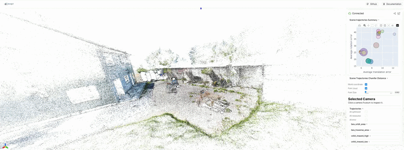
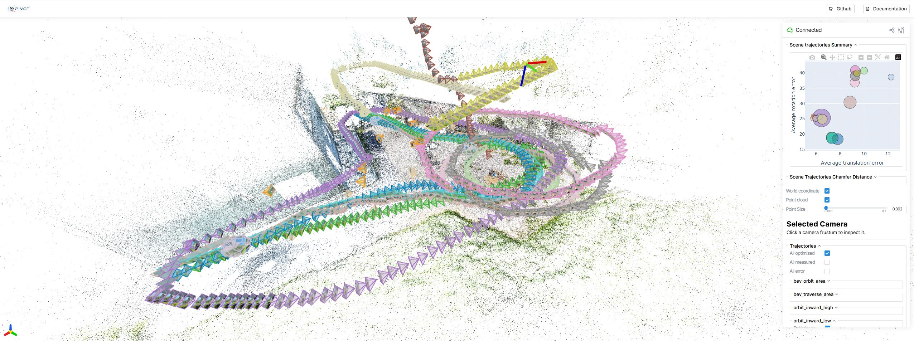
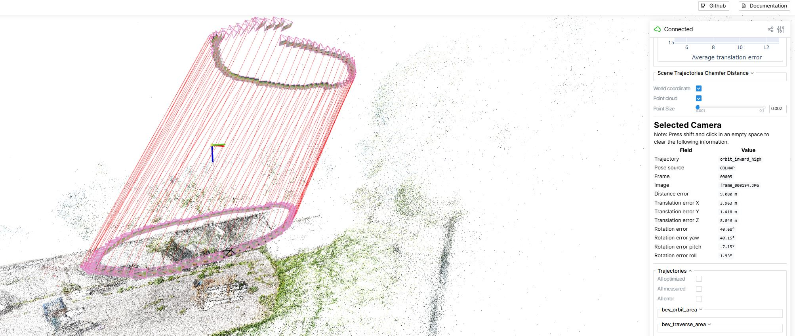
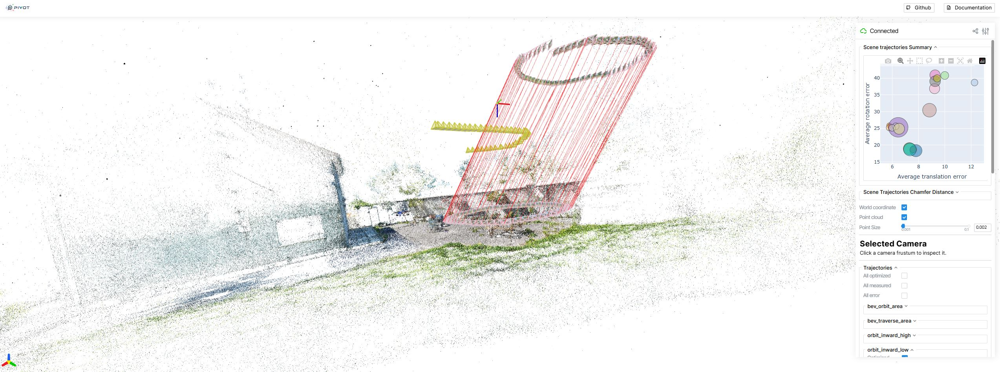
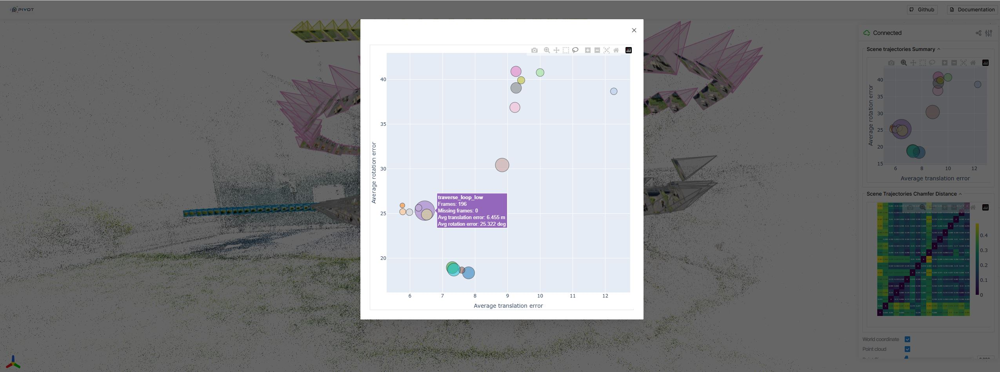
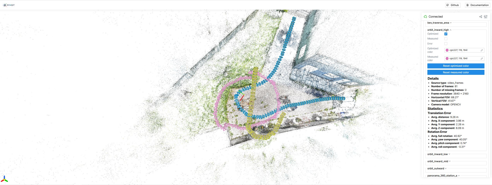
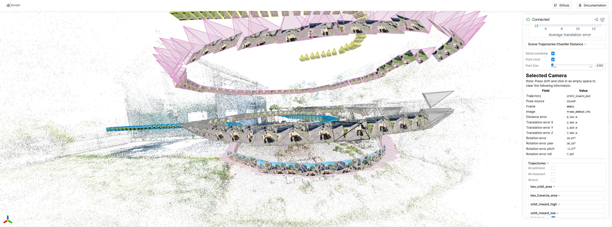

# PIVOT
**Pose, Intrinsics and Viewpoint Oriented Testbed**

# 🛸 A Multi-Trajectory Dataset and TestLab for Pose, Intrinsics and Novel Viewpoint Evaluation in Real-World 3D Reconstruction

> **Benchmarking novel view synthesis where it actually matters — not between training poses, but beyond them.**

[]()
[]()
[](LICENSE)

---

<p align="center">
  
</p>

## Overview
This project is the design and development of a real-world drone-captured dataset and tooling ecosystem for research in neural and classical 3D reconstruction. The central goal is to create a benchmark that moves closer to practical deployment conditions than many existing datasets by combining controlled multi-trajectory image capture, real sensor poses, optimized reconstruction poses, multiple intrinsic calibrations, and structured train/test evaluation protocols.
The dataset is intended to support research in areas such as NeRF, Gaussian Splatting, structure-from-motion, pose refinement, calibration robustness, viewpoint generalization, and scene coverage planning.

<p align="center">
  
</p>

The Test bed consists of multiple components
- The Scene and Trajectory design
- The processing pipeline for the raw captures
- A visualization tool
- Dataset export and backend integration
- Per trajectory evaluation
- Camera calibration 
- Dataset assets

## A Reusable Capture Standard, Not Just a Dataset

This project is not only a dataset — it is a **scene capture specification and open toolchain** that any researcher can use.

We define:

- A **scene format**: what a scene is, how it is structured, what metadata it must carry
- A **trajectory protocol**: a named, typed set of flight trajectories with defined properties (motion type, altitude band, camera direction, lens, capture mode)
- A **processing pipeline**: from raw drone footage to a Nerfstudio-ready dataset, with pose extraction, COLMAP SfM, error metrics, and evaluation — all reproducible

This means you can:

1. **Capture your own scene** by following the trajectory protocol with any compatible drone
2. **Run the pipeline** to get a fully processed, benchmark-ready dataset in the same format
3. **Compare directly** with other scenes captured under the same spec
4. **Extend the trajectory set** — the protocol is designed to be open; you can define new trajectory types and integrate them into the same evaluation framework


The goal is to make this a **living, multi-scene benchmark** where scenes captured by different researchers in different environments are directly comparable, because they all follow the same trajectory protocol and were processed with the same pipeline.

---

## Dataset Design

### Scene Coverage Strategy

Each scene is captured with up to **16 distinct trajectory types** spanning:

- Multiple altitudes (low / mid / high)
- Multiple motion patterns (orbit, traversal, ascent, scatter, panorama)
- Multiple camera directions (inward, outward, nadir)
- Multiple lens types (standard FOV, wide FOV)
- Both video and photo capture modes

This gives a rich, non-redundant sampling of the viewpoint space around a scene — and crucially, trajectories that differ **structurally**, not just incrementally.

<p align="center">
  
</p>

### Trajectory Taxonomy

#### Core Trajectories (captured for every scene)

| Trajectory | Motion | Altitude | Camera | Lens | Resolution | Aspect | Mode | Path closed |
|---|---|---|---|---|---|---|---|---|
| `orbit_inward_low` | Circular orbit | Low | Inward-facing | Standard | 3840×2160 | 16:9 | Video | ✓ |
| `orbit_inward_mid` | Circular orbit | Mid | Inward-facing | Standard | 3840×2160 | 16:9 | Video | ✓ |
| `orbit_inward_high` | Circular orbit | High | Inward-facing | Standard | 3840×2160 | 16:9 | Video | ✓ |
| `traversal_forward_low` | Traversal | Low | Along track | Wide | 3840×2160 | 16:9 | Video | ✗ |
| `traversal_backward_low` | Traversal | Low | Along track | Wide | 3840×2160 | 16:9 | Video | ✗ |
| `traversal_left_low` | Traversal | Low | Along track | Wide | 3840×2160 | 16:9 | Video | ✗ |
| `traversal_right_low` | Traversal | Low | Along track | Wide | 3840×2160 | 16:9 | Video | ✗ |
| `traverse_loop_low` | Traverse loop | Low | Along track | Standard | 3840×2160 | 16:9 | Video | ✓ |
| `bev_orbit_area` | BEV orbit | High | Nadir | Standard | 3840×2160 | 16:9 | Video | ✓ |
| `rocket_upward` | Vertical ascent | Low → High | Inward-facing | Wide | 3840×2160 | 16:9 | Video | ✗ |
| `scattered_low` | Scattered | Low | Multi-angle | Standard | 3840×2160 | 16:9 | Photos | ✗ |
| `panorama_360_station_a` | Panorama 360 | Low | Sweep 360° | Standard | 4032×3024 | 4:3 | Photos | ✓ |
| `panorama_360_station_b` | Panorama 360 | Low | Sweep 360° | Standard | 4032×3024 | 4:3 | Photos | ✓ |
| `panorama_360_station_c` | Panorama 360 | Low | Sweep 360° | Standard | 4032×3024 | 4:3 | Photos | ✓ |
| `orbit_outward_low` | Circular orbit | Low | Outward-facing | Standard | 3840×2160 | 16:9 | Video | ✓ |
| `bev_traverse_area` | BEV traverse | High | Nadir | Standard | 3840×2160 | 16:9 | Video | ✗ |

#### Optional Trajectories

| Trajectory | Motion | Altitude | Camera | Lens | Resolution | Aspect | Mode | Path closed |
|---|---|---|---|---|---|---|---|---|
| `orbit_outward_mid` | Circular orbit | Mid | Outward-facing | Standard | 3840×2160 | 16:9 | Video | ✓ |
| `orbit_outward_high` | Circular orbit | High | Outward-facing | Standard | 3840×2160 | 16:9 | Video | ✓ |
| `traversal_forward_mid` | Traversal | Mid | Along track | Wide | 3840×2160 | 16:9 | Video | ✗ |
| `traversal_backward_mid` | Traversal | Mid | Along track | Wide | 3840×2160 | 16:9 | Video | ✗ |
| `traversal_left_mid` | Traversal | Mid | Along track | Wide | 3840×2160 | 16:9 | Video | ✗ |
| `traversal_right_mid` | Traversal | Mid | Along track | Wide | 3840×2160 | 16:9 | Video | ✗ |
| `traversal_forward_high` | Traversal | High | Along track | Wide | 3840×2160 | 16:9 | Video | ✗ |
| `traversal_backward_high` | Traversal | High | Along track | Wide | 3840×2160 | 16:9 | Video | ✗ |
| `traversal_left_high` | Traversal | High | Along track | Wide | 3840×2160 | 16:9 | Video | ✗ |
| `traversal_right_high` | Traversal | High | Along track | Wide | 3840×2160 | 16:9 | Video | ✗ |
| `scattered_mid` | Scattered | Mid | Multi-angle | Standard | 3840×2160 | 16:9 | Photos | ✗ |
| `scattered_high` | Scattered | High | Multi-angle | Standard | 3840×2160 | 16:9 | Photos | ✗ |

---

## Dual Pose System: Measured vs. Optimized

A second research dimension this dataset enables is studying **pose quality** under realistic conditions.

Every captured frame carries **two independent pose estimates**:

|                                 | Measured Pose                           | Optimized Pose                      |
| ------------------------------- | --------------------------------------- | ----------------------------------- |
| **Source**                | Drone GPS + IMU + gimbal                | COLMAP Structure-from-Motion        |
| **What it represents**    | What a real system knows at flight time | Offline-refined reconstruction pose |
| **Noise characteristics** | GPS/IMU drift, gimbal lag               | SfM reprojection residuals          |
| **Research value**        | Simulates real deployment               | Ground-truth quality reference      |

This enables experiments such as:

- Does a NeRF trained with noisy GPS poses still generalize to far views?
- How much does optimized pose quality matter for cross-trajectory generalization?
- Can you mix optimized rotation with measured translation and still reconstruct well?

<p align="center">
  
</p>

---

## Trajectory Similarity Metric

To support structured train/eval splits and to quantify how different a held-out trajectory is from the training set, PIVOT introduces a **directed pose Chamfer distance** adapted for camera pose sequences.

### Motivation

Not all held-out trajectories are equally distant from training. The metric makes this concrete and computable, enabling: selecting maximally diverse training sets, ranking eval trajectories by distance from training, and understanding the generalization curve.

### Directed Pose Chamfer Distance

For trajectories A and B:

```
D(A → B) = (1 / |A|) * Σ_{a ∈ A} distance(a, closest pose in B)
```

Asymmetric by design: answers *"for every pose in A, how far is the closest pose in B?"*

### Pose Distance

Combines two independently normalised components with equal 0.5 weights — result always in [0, 1]:

- **Translation** — normalised by the scene's AABB diagonal or scene diameter
- **Rotation** — normalised by 180° or the maximum rotation difference observed across all trajectories in the scene

Three variants are computed per trajectory pair:

| Variant | What it measures |
|---|---|
| `tr` | Combined translation + rotation distance |
| `t` | Translation only |
| `r` | Rotation only |

### Trajectory Metrics Matrix

For each scene, a full N×N matrix is built where each cell shows the directed distance from trajectory A to trajectory B. This gives a complete picture of pairwise trajectory coverage gaps across all trajectories in the scene, and is used to inform which trajectories are seen (training) vs. novel (evaluation).

### Future Extension: Geometry-Aware IoU

A planned extension will complement the pose-based metric with a **geometry-aware** measure: the intersection over union (IoU) of the COLMAP sparse points observed by each trajectory:

```
IoU(A, B) = |P_A ∩ P_B| / |P_A ∪ P_B|
```

A low IoU means the two trajectories observe largely different parts of the scene geometry. Combined with the pose Chamfer distance, this gives a trajectory difference matrix with both viewpoint-space and scene-geometry dimensions.

---

## Full Processing Pipeline

```
┌─────────────────────────────────────────────────────────────────────────┐
│                         RAW DRONE CAPTURE                               │
│          Video files + per-frame EXIF metadata (GPS, gimbal)            │
└───────────────────────┬─────────────────────────────────────────────────┘
                        │
                        ▼
          ┌──────────────────────────────────────────┐
          │  data_processing/core/video_processing.py│
          │  Motion-based sampling                   │  ← skips frames with <0.3m movement
          │  EXIF metadata writing                   │     or <10° rotation change
          └────────────┬─────────────────────────────┘
                       │
                       ▼
          ┌──────────────────────────────────────────┐
          │  data_processing/core/metadata_utils.py  │
          │  data_processing/core/image_processing.py│
          │  GPS → NED coordinates                   │
          │  Gimbal → camera pose                    │  ← Measured poses in OpenGL frame
          │  Calibrated intrinsics                   │
          └────────────┬─────────────────────────────┘
                       │
                       ▼
          ┌──────────────────────────────────────────┐
          │  colmap_utils/colmap_processing.py       │
          │  SfM with soft priors                    │  ← GPS positions as covariance-
          │  Feature extraction                      │     weighted COLMAP pose priors
          │  Bundle adjustment                       │
          └────────────┬─────────────────────────────┘
                       │
                       ▼
          ┌──────────────────────────────────────────┐
          │  colmap_utils/colmap_conversion.py       │
          │  COLMAP → NED world                      │  ← Handles all 3 coordinate systems:
          │  OpenCV → OpenGL cam                     │     NED ↔ OpenCV ↔ OpenGL
          └────────────┬─────────────────────────────┘
                       │
                       ▼
          ┌──────────────────────────────────────────┐
          │  data_processing/core/                   │
          │    raw_data_processing_pipeline.py       │
          │  Merge measured + optimized              │
          │  Compute per-frame errors                │  ← scene_data.json
          │  Translation + rotation diff             │
          └────────────┬─────────────────────────────┘
                       │
                       ▼
          ┌──────────────────────────────────────────┐
          │  dataset_export/ns_dataset_creation.py   │
          │  Trajectory-aware train/eval splits      │  ← Configurable per-trajectory:
          │  transforms.json export                  │     pose source, intrinsics,
          │                                          │     frame subsampling
          └────────────┬─────────────────────────────┘
                       │
                       ▼
          ┌─────────────────────────┐
          │   Nerfstudio Training   │
          │  NeRF / GaussianSplat   │
          │  / any NS method        │
          └────────────┬────────────┘
                       │
                       ▼
          ┌──────────────────────────────────────────┐
          │  reconstruction_eval/                    │
          │    model_trajectory_eval.py              │
          │  Per-trajectory metrics                  │  ← PSNR / SSIM / LPIPS
          │  GT vs rendered views                    │     per trajectory, not just global
          └──────────────────────────────────────────┘
```

---

## Code Components

<p align="center">
  
</p>

### `src/data_processing/` — Data Ingestion and Processing

- **`core/raw_data_processing_pipeline.py`** — Pipeline orchestrator (`RawDataProcessingPipeline`). Chains video extraction → pose estimation → COLMAP → error computation → scene_data.json in a single configurable run.
- **`core/video_processing.py`** — Motion-aware frame extraction from drone video. Skips frames below movement thresholds to reduce redundancy while preserving trajectory coverage.
- **`core/image_processing.py`** — Image reading and per-frame metadata loading.
- **`core/metadata_utils.py`** — GPS/gimbal → camera pose conversion. Handles GPS→NED coordinates, gimbal orientation to OpenGL camera matrix, and calibrated intrinsics.
- **`core/camera_metadata_abc.py`** — Abstract interfaces (`CameraTagsMap`, `GpsTagsMap`, `CameraImageMetaData`) that all capture device implementations must satisfy.
- **`supported_capture_devices/dji_drone_mini_4.py`** — Concrete metadata implementation for the DJI Mini 4 Pro.

### `src/colmap_utils/` — COLMAP Integration

- **`colmap_processing.py`** — Wraps PyColmap to run Structure-from-Motion with GPS soft-prior mode (covariance-weighted pose priors). Supports per-trajectory camera model assignment.
- **`colmap_conversion.py`** — Bidirectional conversion between all three coordinate frames: **NED** (drone/geographic), **OpenCV** (COLMAP), and **OpenGL** (NeRF/Nerfstudio). The most intricate module in the codebase.

### `src/utils/` — Shared Math and Utilities

- **`geometry_utils.py`** — Rotation matrices, quaternion conversions, Euler angle differences, and pose error calculations.
- **`gps_utils.py`** — GPS/NED coordinate conversions and ECEF transforms.
- **`camera_utils.py`** — FOV calculations for both standard perspective and fisheye (equidistant) camera models.
- **`metrics.py`** — Pose distance metrics (translation, rotation, combined), directed Chamfer distance between trajectories, and scene normalization (AABB diagonal, scene diameter).
- **`processing_utils.py`** — Camera data extraction from scene_data.json and trajectory comparison utilities.

### `src/dataset_export/` — Nerfstudio Dataset Creation

- **`ns_dataset_creation.py`** — Creates `transforms.json` for Nerfstudio with fine-grained control over pose source (measured vs. optimized) and intrinsics, independently configurable per trajectory. Supports seen/novel trajectory splits.

### `src/reconstruction_eval/` — Model Evaluation

- **`model_trajectory_eval.py`** — Abstract `ReconsModel` interface and `calculate_eval_metrics` function. Reports PSNR/SSIM/LPIPS and pose Chamfer distances **per trajectory**.

### `src/ns_backend/` — Nerfstudio Backend Integration

- **`ns_models_trajectory_eval.py`** — Nerfstudio-specific `ReconsModel` implementation that queries a trained NS model for rendered images.
- **`eval.py`** — Evaluation entry point registered as a Nerfstudio CLI script (`ns-eval`).

### `src/visualization/` — 3D Scene Inspector

- **`viser_visualization.py`** — Interactive Viser-based web viewer with color-coded trajectory paths, camera frustums, measured vs. optimized pose overlays, error vector rendering, per-trajectory statistics, and clickable per-camera inspection. See the [Visualization Tool](#-visualization-tool) section below for full details.

### `src/calibration/` — Camera Calibration

- **`camera_calibration.py`** — OpenCV-based camera calibration from a checkerboard image set. Outputs calibration JSON files consumed by the processing pipeline.

### `scripts/` — CLI Entry Points

- **`process_raw_data.py`** — Run the full raw data processing pipeline on a scene.
- **`export_dataset.py`** — Export a processed scene to Nerfstudio-ready format.
- **`visualize_scene.py`** — Launch the interactive 3D visualization viewer.
- **`calibrate_camera.py`** — Run camera calibration.

### `scripts/benchmarks/` — Benchmark Automation

Shell scripts for end-to-end benchmark traces and Python scripts for result aggregation and table generation.

---

## Research Use Cases

### 1. 📐 Measuring True Novel View Generalization

Train on one or more trajectory types, evaluate on structurally different held-out trajectories. Plot reconstruction quality as a function of viewpoint distance from training.

```
Example: Train on orbit_inward_* → Evaluate on traversal_* and bev_*
         How much does quality drop as views move further from training distribution?
```

### 2. 🎯 Pose Quality Sensitivity

Swap measured (GPS) vs. optimized (COLMAP) poses at training time, evaluate the same way. Quantify how much pose quality matters for far-view generalization.

```
Example: Train NeRF with GPS poses vs. COLMAP poses
         Does pose noise disproportionately hurt cross-trajectory evaluation?
```

### 3. 🔬 Trajectory Design for Efficient Capture

Given a budget of N training images, which combination of trajectories maximizes generalization to all held-out views? A principled answer to the "which views should I capture?" question.

### 4. 📏 Altitude and Viewpoint Diversity

Orbits at three altitudes — low, mid, high — allow isolating the effect of altitude coverage on reconstruction completeness and novel view quality.

### 5. 🔭 Calibration Sensitivity

Multiple intrinsic sources (factory calibration, OpenCV calibration, COLMAP-optimized) enable ablation studies on how intrinsic accuracy affects reconstruction at various view distances.

---

## Coordinate Systems

The project works with three coordinate frames that require careful handling throughout the pipeline:

```
NED (drone world)          OpenCV (COLMAP)          OpenGL (NeRF)
──────────────────         ───────────────          ─────────────
X → North                  X → Right                X → Right
Y → East                   Y → Down                 Y → Up
Z → Down                   Z → Forward              Z → Backward
Origin: GPS ref point      Origin: first camera     Origin: scene center
```

Conversion functions in `colmap_utils/colmap_conversion.py` handle all transitions between these systems.

---

## 🔭 Visualization Tool

The visualization tool is one of the most distinctive components of this project. It is an interactive 3D web viewer (built on [Viser](https://github.com/nerfstudio-project/viser)) that serves three purposes simultaneously: **scene inspection**, **pose error analysis**, and **experiment design**.

### Scene View

The 3D viewer renders the full reconstructed scene together with all trajectory data:

- **Sparse point cloud** from COLMAP reconstruction as the scene backdrop
- **Color-coded camera frustums** — each trajectory gets a unique color; measured and optimized poses for the same trajectory share the color but differ in style
- **Red error vectors** — a line drawn from each measured camera position to its corresponding optimized position, making GPS/gimbal drift immediately visible at a glance
- **Image thumbnails** overlaid on the frustum planes — you can see the actual captured image projected onto each camera's field of view in 3D space
- **Trajectory path lines** showing capture order and spatial coverage

<p align="center">
  
</p>

### Error Statistics

The tool surfaces pose error data both **numerically** and **visually**:

**Trajectory-level summary chart** — a bubble scatter plot with:

- X axis: average translation error (metres) per trajectory
- Y axis: average rotation error (degrees) per trajectory
- Bubble size: proportional to number of frames
- One bubble per trajectory, color-matched to the scene view

This gives an immediate visual overview of which trajectories have well-aligned GPS poses and which have significant drift — critical for deciding which pose source to use in experiments.

<p align="center">
  
</p>

**Per-trajectory stats panel** — click any trajectory to see:

- Number of frames / missing frames
- Frame resolution and camera model (OPENCV / OPENCV\_FISHEYE)
- Horizontal and vertical FOV
- Average translation error: total distance + X / Y / Z components (metres)
- Average rotation error: total + yaw / pitch / roll (degrees)

<p align="center">
  
</p>

**Per-camera inspection** — click any individual camera frustum to see:

- Which trajectory and frame it belongs to
- Pose source (COLMAP optimized vs. measured)
- Full 6DOF error breakdown: distance error, translation X/Y/Z, rotation total/yaw/pitch/roll

<p align="center">
  
</p>

### Interactive Controls

All layers are independently togglable:

| Control               | What it shows/hides                               |
| --------------------- | ------------------------------------------------- |
| Per-trajectory toggle | All frustums and paths for that trajectory        |
| Optimized poses       | COLMAP-optimized camera frustums                  |
| Measured poses        | GPS/gimbal camera frustums                        |
| Error vectors         | Red lines between measured and optimized centers  |
| Point cloud           | COLMAP sparse reconstruction                      |
| Image thumbnails      | Actual captured images on frustum planes          |
| Color pickers         | Customize per-trajectory colors for presentations |

### As an Experiment Design Tool

Beyond debugging, the viewer is a practical tool for **planning benchmark experiments before running them**:

- Visually inspect which trajectories are spatially close or far from each other — directly informing which train/eval splits are meaningful
- Use the error bubble chart to decide whether measured or optimized poses are suitable for a given trajectory
- Check FOV and camera model differences across trajectories before mixing them in a training set
- Identify frames with unusually high pose errors that should be excluded

---

## Notebooks

| Notebook                                       | Purpose                                                     |
| ---------------------------------------------- | ----------------------------------------------------------- |
| `process_video.ipynb`                        | Extract frames from drone video with motion sampling        |
| `colmap_processing.ipynb`                    | Run COLMAP SfM on an image set                              |
| `process_dataset_trace_from_raw.ipynb`       | **Main pipeline** — raw capture → scene_data.json   |
| `create_nerfstudio_from_colmap.ipynb`        | Direct COLMAP → Nerfstudio export                          |
| `process_to_ns_dataset.ipynb`                | scene_data.json → Nerfstudio with custom trajectory config |
| `visualize_scene.ipynb`                      | 3D scene visualization with trajectory overlays             |
| `colmap_processing_soft_prior.ipynb`         | COLMAP with GPS pose priors                                 |
| `drone_metadata_use_and_visualization.ipynb` | Explore raw drone telemetry                                 |
| `opencv_camera_calibration.ipynb`            | Camera calibration workflow                                 |
| `nerftusio_drone_eval.ipynb`                 | Run per-trajectory evaluation metrics                       |

---

## Project Status

### ✅ Implemented

- Raw video frame extraction with motion-based sampling
- GPS/gimbal → camera pose extraction
- COLMAP SfM with soft GPS priors
- Measured vs. optimized pose comparison and error metrics
- scene_data.json: unified scene descriptor format
- Flexible Nerfstudio dataset export (per-trajectory pose/intrinsic config)
- Per-trajectory PSNR/SSIM/LPIPS evaluation
- Directed Chamfer distance for poses to measure the trajectory similarity
- Interactive 3D visualization (Viser)
- Camera frustum and trajectory path rendering
- Docker environment

### 🔄 In Progress

- Add Per trajectory FID
- Implement trajectory similarity measure using intersection over union of the seen sparse point for the trajectory cameras
- Multi-scene capture expansion
- Dense reconstruction support
- Automated metadata validation
- Public sample scene release

---

## Environment Setup

### Docker (Recommended)

```bash
# Build
docker build -t drone3d .

# Run with GPU
bash run_docker.sh

# Run with Jupyter
bash run_docker_jupyter.sh
```

---

## Repository Structure

```
drone_3d_dataset/
├── src/
│   ├── calibration/
│   │   └── camera_calibration.py              # OpenCV camera calibration
│   ├── colmap_utils/
│   │   ├── colmap_conversion.py               # NED ↔ OpenCV ↔ OpenGL conversions
│   │   └── colmap_processing.py               # SfM with GPS soft priors
│   ├── data_processing/
│   │   ├── core/
│   │   │   ├── camera_metadata_abc.py         # Abstract metadata interfaces
│   │   │   ├── image_processing.py            # Image reading and metadata loading
│   │   │   ├── metadata_utils.py              # GPS/gimbal → camera pose
│   │   │   ├── raw_data_processing_pipeline.py # Pipeline orchestrator
│   │   │   └── video_processing.py            # Video frame extraction and sampling
│   │   └── supported_capture_devices/
│   │       └── dji_drone_mini_4.py            # DJI Mini 4 Pro capture device
│   ├── dataset_export/
│   │   ├── ns_dataset_creation.py             # Nerfstudio transforms.json exporter
│   │   └── pyproject.toml
│   ├── ns_backend/
│   │   ├── eval.py                            # ns-eval entry point
│   │   └── ns_models_trajectory_eval.py       # Nerfstudio model wrapper
│   ├── reconstruction_eval/
│   │   ├── model_trajectory_eval.py           # Per-trajectory PSNR/SSIM/LPIPS
│   │   └── pyproject.toml
│   ├── utils/
│   │   ├── camera_utils.py                    # FOV calculations
│   │   ├── geometry_utils.py                  # Rotation/pose math
│   │   ├── gps_utils.py                       # GPS/NED coordinate conversions
│   │   ├── metrics.py                         # Pose distance and Chamfer metrics
│   │   ├── processing_utils.py                # Camera data and trajectory utilities
│   │   └── pyproject.toml
│   └── visualization/
│       └── viser_visualization.py             # Interactive 3D scene viewer
├── scripts/
│   ├── calibrate_camera.py                    # Camera calibration CLI
│   ├── export_dataset.py                      # Nerfstudio export CLI
│   ├── process_raw_data.py                    # Raw data processing CLI
│   ├── visualize_scene.py                     # Visualization launcher CLI
│   └── benchmarks/
│       ├── run_benchmarks.sh                  # Run all benchmark traces
│       ├── run_bm_cam_calibr_trace.sh         # Camera calibration benchmark
│       ├── run_bm_nv_trace.sh                 # Novel view benchmark
│       ├── run_bm_poses_trace.sh              # Pose quality benchmark
│       ├── summarize_results/                 # Result aggregation scripts
│       └── pyproject.toml
├── tests/
│   ├── test_calibrate_camera.sh
│   ├── test_export_dataset.sh
│   ├── test_process_raw_data.sh
│   └── test_visualize_scene.sh
├── notebooks/                                 # Jupyter workflow notebooks
├── data/
│   ├── trajectories_metadata.json             # Trajectory type definitions
│   └── *_calibration.json                    # Camera intrinsic calibrations
├── docs/                                      # Documentation and design docs
├── Dockerfile
└── requirements.txt
```

---

## Citation

> Paper in preparation. BibTeX will be added upon publication.

```bibtex
@misc{pivot2026,
  title        = {PIVOT: Pose, Intrinsics and Viewpoint Oriented Testbed},
  author       = {Mary Raymond},
  year         = {2026},
  howpublished = {\url{https://github.com/maryraymond/PIVOT.git}},
  note         = {Accessed: 2027-01-15}
}
```

---

*Built for real-world drone reconstruction research. If the evaluation setup interests you or you'd like to collaborate on captures, open an issue or reach out directly.*
